# DSR (Digital Satellite Radio) – Encoder & Decoder

C++17 implementation of IRT Technische Richtlinie 3 R 1 (Ausgabe 3, Nov. 1989).

## About the system

**DSR** (*Digitaler Satelliten-Rundfunk*, "Digital Satellite Radio") was the first fully
digital radio broadcast system in Germany: 16 stereo programmes in CD-like quality,
transmitted **without any data reduction** (no MPEG), at a time when digital audio
on satellite was still a research topic.

### History
* **1980s – development.** Developed in Germany under the Federal Research Ministry (BMFT)
  by the broadcasters' Institut für Rundfunktechnik (IRT) together with industry. The
  technical guideline *3 R 1* of ARD/ZDF defines the transmission method (edition 2: Aug 1985,
  edition 3: Nov 1989 – the one implemented here).
* **1982.** Telefunken showed a first DSR receiver prototype at the HIFIVIDEO fair in Düsseldorf.
* **August 1989 – start of service** (Internationale Funkausstellung Berlin). The 16-programme
  package ran on the direct-broadcast satellite **TV-SAT 2** (launched 8 Aug 1989) and on
  **DFS Kopernikus 1**, and was fed into the cable network of the Deutsche Bundespost
  (later Telekom) on 118 MHz (special channels S2/S3). Receivers were expensive at first
  (well above 1000 DM) and needed a dedicated tuner; the TV-SAT dish was a special flat antenna.
* **1992.** The DSR package moved to **DFS Kopernikus 3**; TV-SAT 2 stopped carrying it at the
  end of 1994.
* **1995 onwards – competition.** Astra Digital Radio (ADR) and later DVB made it possible to
  carry far more programmes per transponder with MPEG audio coding.
* **16 January 1999, 00:01 – shutdown in Germany.** The cable channels S2/S3 were needed for
  analogue TV; DSR was switched off despite listener protests. Successors were ADR, DVB-S and
  DVB-C. (Sources mention that transmissions in Switzerland continued longer.)

Many programmes were classical/cultural channels of the public broadcasters; the system
never reached a mass market, but it remains the highest-quality digital radio service
Germany has had, which is why receivers (e.g. the Technisat DSR 5000/5002) are still popular
among collectors.

### Key technical data
| Item | Value |
|---|---|
| Programmes | 16 stereo (or 32 mono) per transponder |
| Audio | 32 kHz sampling, 16 bit source -> 14 bit near-instantaneous companding (3-bit scale factor per 64 samples = 2 ms) |
| Error protection | BCH(63,44) on the 11 MSBs of 4 channels, scale factors BCH(14,6) sent 3x |
| Frame | 320 bit @ 32 kHz = 10.24 Mbit/s; two frames A/B (Barker-11 sync, B inverted) |
| Net bit rate | 2 x 10.24 = 20.48 Mbit/s |
| Modulation | coherent QPSK, differential encoding, scrambler, 50 % root-cos roll-off (about 15.4 MHz bandwidth) |
| Side channels | special-service bit: programme offer (PA, type/music/speech) and 8-character station name (SK); PI data channel (22 bit / 2 ms) |

### System overview

```mermaid
flowchart LR
  subgraph ENC["dsr_encoder"]
    direction TB
    S["Up to 16 stereo sources<br/>WAV / MP3 / internet radio<br/>(ffmpeg, 32 kHz s16)"]
    C["Audio coding<br/>16 to 14 bit companding<br/>scale factor per 2 ms block<br/>(sent 4 ms ahead)"]
    M["Multiplex<br/>BCH(63,44) 77-bit blocks<br/>interleaving, ZI frame, PA/SK<br/>2 main frames A and B<br/>320 bit, Barker sync"]
    X["Scrambler (x^9+x^4+1)<br/>differential encoder"]
    Q["QPSK mapping<br/>RRC filter, roll-off 0.5<br/>10.24 MBd"]
    S --> C --> M --> X --> Q
  end
  L["Baseband stream<br/>I/Q int16 or float32, 20.48 MS/s<br/>or real IF (fs/4)<br/>file / stdout / TCP 127.0.0.1"]
  subgraph DEC["dsr_decoder"]
    direction TB
    D["Matched filter, AGC<br/>Gardner timing recovery<br/>Costas carrier loop"]
    F["Differential decoder<br/>Barker frame sync (A/B swap)<br/>descrambler, de-interleaver"]
    B["BCH error correction<br/>Williard sync, scale factors<br/>PA/SK programme list"]
    P["14 to 16 bit expansion<br/>selected station<br/>concealment"]
    D --> F --> B --> P
  end
  O["Sound card (aplay)<br/>or WAV file"]
  R["Real DSR receiver<br/>(Technisat DSR 5000/5002)"]
  Q --> L --> D
  P --> O
  L -.-> R
```




### Verified
* Sound output on real hardware (Debian 13) works.
* Signals from `dsr_encoder` are received and decoded by real **Technisat DSR 5000 and DSR 5002** receivers.
* A live internet radio stream (AAC over HTTPS, via ffmpeg) works as an encoder input, mixed with a
  local MP3 file and a test tone in one multiplex.
* A baseband file generated by the independent encoder [fsphil/dsr](https://github.com/fsphil/dsr)
  is decoded by `dsr_decoder` and is audible (see the cross-check section below).
No external libraries; ffmpeg (inputs) and aplay (sound output) are used as programs.

    sudo apt install g++ make ffmpeg alsa-utils     # Debian 13
  
    make                                            # -> dsr_encoder, dsr_decoder

## Encoder
    # 3 stations, real time, I/Q int16 @ 20.48 MS/s on a local TCP port (server)
    ./dsr_encoder -i 1=music.mp3 -n 1="MyRadio" -p 1=10 \
                  -i 2=http://icecast.example/stream -n 2="Live" -p 2=1 -m 2=speech \
                  -i 3=tone:440,660 -o tcp://127.0.0.1:5000

    # offline into a file, real IF at fs/4 (40.96 MS/s, int16)
    ./dsr_encoder -i 1=a.wav -f real16 -o dsr.s16

Formats: `cs16` (I/Q int16), `cf32` (I/Q float), `real16` (IF = fs/4, sps 4 or 8).
Stations 1..16; sources: any ffmpeg input, `tone:F[,F]`, `raw:PATH`.

## Decoder
    ./dsr_decoder -i tcp://127.0.0.1:5000 -s 2            # plays via aplay
    ./dsr_decoder -i dsr.cs16 -s 1 -o out.wav --list      # to WAV
While running: `1`..`16` + Enter = switch station, `+`/`-` = next/previous announced
station, `l` = programme list, `h` = help, `q` = quit.
Same commands over a local control port for scripts/GUIs:

    ./dsr_decoder -i tcp://127.0.0.1:5000 --control 6000 &
    echo l | nc -q1 127.0.0.1 6000        # programme list
    echo 5 | nc -q1 127.0.0.1 6000        # tune station 5

## Encoder as a permanent server
`-o tcp://127.0.0.1:PORT` keeps listening for the whole run time: decoders may connect,
disconnect and reconnect at any time, several at once. Without any client the stream is
discarded (the encoder keeps its real-time clock and keeps consuming live sources).
A client that falls behind by more than ~1.5 s of data is dropped so it can never stall
the encoder. The decoder reconnects automatically if the encoder is restarted.
`--loop` repeats file sources forever.
Use `--play "pw-play --rate 32000 --channels 2 --format s16 -"` for other players.

## Files
dsr.hpp (protocol: BCH, 16/14-bit coding, frames, scrambler, PA/SK, PI),
dsr_dsp.hpp (RRC shaping, QPSK demodulator), dsr_io.hpp (pipes/TCP),
dsr_encoder.cpp, dsr_decoder.cpp.

## Tested (loopback)
Station tones recovered exactly; real16 and I/Q; 20 kHz carrier offset, 20 ppm
clock offset, half-sample timing offset; 7 dB SNR (BCH corrects, rest concealed);
swapped A/B (inverted spectrum) auto-detected; real-time TCP with mp3/wav via ffmpeg.
The decoder needs ~0.8 core-seconds per second of signal (cs16, -O3 -march=native).

Hardware and live-stream results (sound card, Technisat DSR 5000/5002 receivers, internet radio URL as
encoder input) were verified too, see "Verified" above.

## System requirements & performance

DSR is a *wide-band* signal: even at the lowest sensible rate the baseband stream has
**20.48 million complex samples per second (82 MB/s)**. 

### Short version
| You want to... | You need (rule of thumb) |
|---|---|
| Listen with the decoder only (stream comes from elsewhere) | any x86-64 PC from about 2015 or later (Core i3 / Ryzen 3 class, ~2.5 GHz, AVX2), 1 free core |
| Run encoder **and** decoder on one machine (the usual setup) | **2 cores minimum, 4 recommended** |
| Only run the encoder (e.g. feed an SDR / file) | 1 core, even with 16 stations |
| Raspberry Pi 4 or similar small ARM board | encoder: probably OK; decoder: **probably too slow** (see below) |
| Use the `real16` (real IF) format live | a vy fast desktop CPU; on slower machines write to a file instead |

RAM is not an issue (a few tens of MB). Disk: a baseband **file** needs **82 MB per second**
(about 5 GB per minute, 295 GB per hour) in the default `cs16` format - mind your free space!

### What was measured
Test machine: one core of an Intel Xeon VM at about 2.1 GHz, 16 active stations,
built with the Makefile's `-O3 -ffast-math -march=native`. Numbers are CPU seconds needed per
second of signal - **below 1.0 means real time is possible**:

| Format (`-f`) | Samples/symbol | Sample rate | Encoder | Decoder |
|---|---|---|---|---|
| `cs16` (default) | 2 | 20.48 MS/s | 0.41 | 0.67 |
| `cf32` | 2 | 20.48 MS/s | 0.64 | 0.71 |
| `real16` | 4 | 40.96 MS/s | 0.54 | **1.09** (too slow for live use on this core) |

Each station's ffmpeg process (MP3/AAC decoding and resampling) adds roughly 1-3 % of a
core; 16 live internet streams add a few tens of percent in total.
Raspberry Pi is an *estimate*, not a measurement!

### Check your own machine in 30 seconds
```bash
# 10 s of test signal with 16 stations, written as fast as possible (needs ~820 MB disk)
args=""; for i in $(seq 1 16); do args="$args -i $i=tone:$((300+i*100))"; done
time ./dsr_encoder $args -t 10 -o /tmp/test.cs16
time ./dsr_decoder -i /tmp/test.cs16 -s 5 -o /tmp/test.wav
rm /tmp/test.cs16
```
Compare the `real` time with the 10 s of signal: **encoder and decoder must each finish in
clearly less than 10 s** (say under 7 s) to be safe in real time. Running both at once on one
machine needs two free cores, so also look at your CPU load while they run.

### If it does not run smoothly
* **Stuttering sound / gaps:** the decoder is too slow for your CPU. Close other programs,
  make sure you built with `make` (optimisation on) and did not copy a binary from another
  PC (`-march=native` binaries only run on the CPU family they were built on).
* **"client too slow - disconnected" in the encoder log:** the decoder cannot keep up with
  the stream (or is paused). The encoder protects itself by dropping that client; the decoder
  reconnects automatically. A faster CPU or fewer other tasks is the cure.
* **Virtual machines, WSL, containers:** usually 20-50 % slower than bare metal and prone to
  scheduling hiccups. Give the VM at least 2-4 dedicated cores.
* **Battery / power-saving mode on laptops:** switch to "performance"; DSR needs sustained
  CPU, not bursts.
* **Slow storage:** writing 82 MB/s to an SD card or USB stick will not keep up - use an SSD,
  or the TCP port instead of a file.
* **Raspberry Pi and similar:** use the encoder there if you like, but run the decoder on a
  PC. Do not use `real16` or `cf32` unless you need them (they double the data rate or CPU cost).

### Future optimisation
The decoder is currently single-threaded and its matched filter does not exploit the filter's
symmetry. Using both (multi-threading, SIMD-friendly symmetric FIR) should make it roughly
1.5-2x faster, which would bring small ARM boards and `real16` live decoding into reach.
